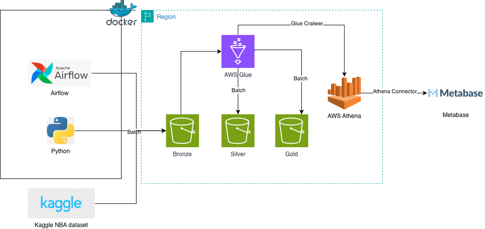

# 🏀 End-to-End NBA Analytics Data Warehouse

A **fault‑tolerant**, medallion‑architecture data pipeline that ingests NBA team and player statistics, processes them through AWS S3 and AWS Glue, and serves interactive dashboards via a containerized metadata layer. Orchestration is handled by **Apache Airflow** (Dockerized), data transformations run on **AWS Glue** (Spark SQL), and a **Metasbase** (Dockerized) for Visualize.

---

## 📌 Overview

This project demonstrates a **hybrid data platform**:
- **Data Lake** on AWS S3 with Madellion architecture.
- **Serverless processing** with AWS Glue .
- **Orchestration** via Airflow running in Docker for scheduling, monitoring, and failure handling.
- **Interactive dashboards** built with AWS Athena connected to Metabase.

**Key Features**
- Medallion architecture (Bronze/Silver/Gold) for data quality and governance.
- Fault‑tolerant orchestration with Airflow (retries, alerting, idempotency).
- Containerized control plane – Airflow + Metastore run in Docker for portability.
- BI dashboards on Gold‑layer data.

---

## 🏗️ Architecture



├──► Kaggle Dataset

├──►  Airflow (Docker) 

├──► S3 (Bronze) - raw data landing zone

├──► AWS Glue (Silver) - clean, deduplicate, type cast

├──► S3 (Silver) - cleaned, partitioned Parquet

├──► AWS Glue (Gold) - build aggregated tables

├──► S3 (Gold) - reporting‑ready datasets

└──► Metabase - dashboards & ad‑hoc analysis


---

## 🛠️ Technologies Used

| Component           | Technology                                    | Purpose                                      |
| ------------------- | --------------------------------------------- | -------------------------------------------- |
| Orchestration       | Apache Airflow (Docker container)             | Schedule and monitor monthly pipeline runs   |
| Data Lake Storage   | Amazon S3                                     | Tiered storage: `bronze/`, `silver/`, `gold/`|
| Data Processing     | AWS Glue (Spark SQL, PySpark)                 | Transform raw data into clean, aggregated tables |
|  Query Engine | AWS Athena          | Store table schemas, enable SQL queries on S3|
| Visualization       | Metabase       | Build interactive dashboards                  |
| Source Data         | Kaggle                                    | Fetch NBA stats    |
| Container Runtime   | Docker / Docker Compose                        | Run Airflow and Metabase locally  |

---

## 📦 Pipeline Details

### 1️⃣ Data Ingestion (Bronze)
- **Airflow DAG** (Docker) triggers monthly (configurable via `schedule_interval`).
- Uses **Kaggle API** to download the latest NBA dataset (CSV/JSON).
- Stores raw files into `s3://your-bucket/bronze/` with partitions by `year` and `month` (e.g., `year=2024/month=02/`).

### 2️⃣ Data Cleansing (Silver)
- **AWS Glue ETL job** (PySpark script) reads from Bronze.
- Performs:
  - Schema enforcement and type casting (e.g., string → integer, date).
  - Handling missing values (drop or impute).
  - Deduplication based on game/player IDs.
  - Handle traded mid season
- Writes **Parquet** format (optimized for analytics) to `s3://your-bucket/silver/`, partitioned by `season` and `team`.


### 3️⃣ Data Aggregation (Gold)
- **Second Glue job** builds dimensional models:
  - **Player career stats** – averages per season, shooting percentages.
  - **Team performance** – win/loss streaks, offensive/defensive ratings.
  - **Advanced metrics** – PER, usage rate, true shooting percentage.
- Outputs to `s3://your-bucket/gold/` in Parquet, also partitioned for efficient queries.

### 4️⃣ Visualization
- BI tool connects to the Hive Metastore via JDBC/Thrift.
- Users can run SQL queries directly on S3 data (metastore provides schema and partition locations).
- Dashboards include:
  - Top scorers over time.
  - Team efficiency comparisons.
  - Interactive filters by player, team, season.
  - Historical trend charts.

---

## ⚙️ Fault Tolerance & Reliability

- **Airflow retries** – failed tasks automatically retry up to 3 times (configurable in DAG).
- **Data validation** – Glue jobs perform row count and schema checks before writing.
- **Idempotent writes** – each run overwrites only the relevant partitions, avoiding duplicates. 
- **S3 versioning** – enabled on Bronze bucket to recover raw data if needed.
- **Container health checks** – Docker Compose ensures Airflow and Metabase services restart on failure.

---


### Prerequisites
- AWS account with permissions for S3, Glue, and Athena.
- Docker and Docker Compose installed .

### To start
```bash
cd ./Airflow

docker-compose up -d
```
This launches:
Airflow webserver & scheduler (UI at http://localhost:8080)

```bash
docker run -d -p 3000:3000 --name metabase metabase/metabase 
```
This lauches:
metabase dashboard (UI at http://localhost:3000)

📊 Example Dashboard

Player Comparison: Top 10 player with highest 3pt percentage

Team Trends: Line chart of points per game over the last 10 seasons.

Leaderboards: Top 10 scorers since 2016.

